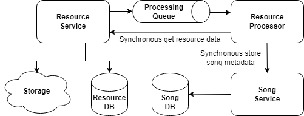
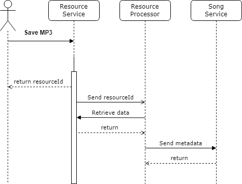

# Module 2: Microservices communication

## Table of contents

- [What to do](#what-to-do)
- [Sub-task 1: Asynchronous communication](#sub-task-1-asynchronous-communication)
- [Sub-task 2: Event handling](#sub-task-2-event-handling)
- [Sub-task 3: Retry mechanism](#sub-task-3-retry-mechanism)
- [FAQ](#faq)

## What to do

This module aims to enhance the existing microservices by introducing cross-service communication. This involves integrating **Resource Service** and **Resource Processor** using both asynchronous messaging and synchronous calls.

## Sub-task 1: Asynchronous communication

1. **Add asynchronous messaging**: Set up asynchronous communication between the **Resource Service** and **Resource Processor** using a messaging broker.
2. **Send resource details**: Upon successful resource upload, the **Resource Service** should send a message to the **Resource Processor** containing the `resourceId`.

   You can use any messaging broker, such as [RabbitMQ](https://hub.docker.com/_/rabbitmq), [ActiveMQ](https://hub.docker.com/r/rmohr/activemq), or another broker of your choice. It is recommended to consult an expert for the best fit for your use case.

## Sub-task 2: Event handling

1. **Event-triggered processing**: When the **Resource Processor** receives a message from the queue, it should:
    - Make a **synchronous call** to the **Resource Service** to retrieve the resource data (in binary format).
    - Extract the metadata from the resource.
    - Make another **synchronous call** to the **Song Service** to save the extracted song metadata.

2. **Queue listening/subscription**: Implement a mechanism for listening to events in the queue. For example, you could use [Spring Cloud Stream with RabbitMQ](https://docs.spring.io/spring-cloud-stream-binder-rabbit/docs/current/reference/html/spring-cloud-stream-binder-rabbit.html).

## Sub-task 3: Retry mechanism

Implement a **retry mechanism** to enhance the reliability of communication between services. This applies to both asynchronous and synchronous communications, ensuring that temporary issues do not result in permanent failures.

Options for implementing the retry mechanism include:

1. **Retry Pattern**: Use a [Retry Pattern](https://docs.microsoft.com/en-us/azure/architecture/patterns/retry) to handle transient failures gracefully.
2. **Spring Retry Tools**:
   - Utilize [Spring Retry Template](https://docs.spring.io/spring-batch/docs/current/reference/html/retry.html) to implement retry logic for communication issues.
   - Alternatively, use annotations such as `@Retryable` to simplify retry implementation.

Refer to the diagrams below for clarification:

---

## FAQ

> **Q:** Why do we need to transfer the entire file in binary format to the **Resource Processor**? Wouldn't it be more efficient to extract metadata in the **Resource Service** or pass a direct link to the storage?

**A:** You are correct that in a production environment, minimizing network traffic is often a priority (e.g., passing a presigned URL or extracting metadata locally). However, the task specifically requires the following flow:

1. The **Resource Service** stores the uploaded file in cloud storage and sends a message with the `resourceId` to the queue (Asynchronous).
2. The **Resource Processor** consumes the message and makes a **synchronous call** to the **Resource Service** to retrieve the actual file data (binary).
3. After receiving the file, the **Resource Processor** extracts the metadata and calls the **Song Service** to save it.

This architecture is designed specifically for **educational purposes** to practice the following:

- **Separation of concerns:** We enforce a strict boundary where the **Resource Service** handles I/O operations (storage/retrieval), while the **Resource Processor** handles CPU-intensive tasks (parsing/processing).
- **Communication patterns:** This flow requires you to implement a hybrid approach:
   - **Asynchronous:** Notification via a message broker.
   - **Synchronous:** Retrieving binary data via HTTP/REST.
- **Handling binary streams:** It provides practice in implementing clients that consume and process binary streams, which is a valuable skill for microservices communication.

Please follow the architecture as described in the **Event handling** section and the provided diagrams.

---

> **Q:** Should I use the message broker for the `DELETE` operation as well? I implemented it so the **Resource Processor** listens for deletion events.

**A:** No, please revert to a synchronous approach. The asynchronous communication pattern introduced in this module is specifically for the **creation and processing** workflow (Upload → Queue → Processor).

For deletion, the logic should remain a **synchronous** cascading call from **Resource Service** to **Song Service**, as established in previous modules. Using asynchronous messaging for deletion in this context introduces unnecessary risks:
- **Eventual Consistency:** The resource might be physically deleted while its metadata "hangs" visible to users until the event is processed.
- **Complexity:** Managing retries and ordering for deletion events adds overhead that is not required for this task.

---

> **Q:** I see potential consistency issues. For example:
> 
> **Scenario 1:** A file is saved to S3, but the DB transaction fails. If the S3 deletion fallback also fails, we get an orphaned file.
> 
> **Scenario 2:** A file is saved to S3 and DB, but the message broker is down, so the event is lost.
> 
> Should we implement patterns like **Transactional Outbox** to handle these?

**A:** While these are valid concerns for a production system, complex patterns like **Transactional Outbox** or **Saga** are **out of scope** for Module 2.

- **For Scenario 1 (S3 Consistency):** At this stage, it is acceptable to risk having "orphaned" files if a transaction rolls back but S3 deletion fails. You can add retries for the cleanup logic, but a full distributed transaction solution is not required yet.
- **For Scenario 2 (Message Broker failures):** This is exactly addressed by **Sub-task 3: Retry mechanism**. You should focus on a solid retry strategy (using Spring Retry or `@Retryable`) combined with persistent queues.

Advanced consistency patterns and dedicated storage state management (e.g., `STAGING`/`PERMANENT` states) will be introduced later in **Module 6: Fault tolerance**. For now, rely on **Retries** and **Idempotency**.